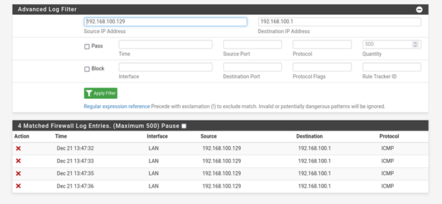
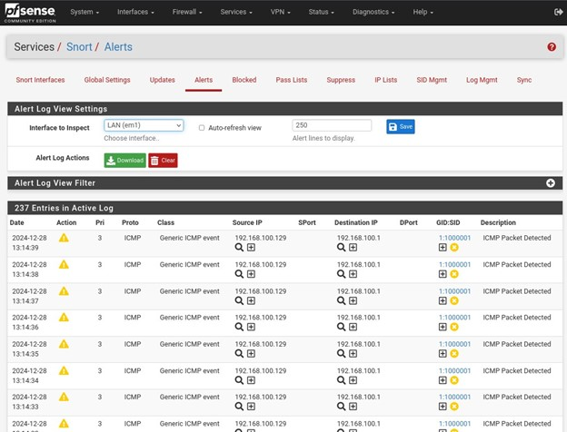
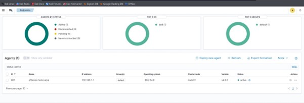

# IDS Integration Using pfSense, Snort, and Wazuh

This project demonstrates the integration of pfSense (firewall), Snort (IDS/IPS), and Wazuh (SIEM) to create a layered intrusion detection and monitoring system. The project report includes details of the network setup, configurations, testing methodology, and results.

## Project Information
The detailed project documentation is available in the `report.pdf` file. It includes the following sections:

- Introduction  
- System Architecture  
- Implementation Methodology (pfSense, Snort, Wazuh)  
- Testing and Validation  
- Results and Discussion  
- Future Work
  
## Results
The system successfully detected and logged malicious activities.  
Below are some sample results:

- **pfSense Firewall Blocking ICMP Traffic:**  
  

- **Snort IDS Alerts:**  
  

- **Wazuh SIEM Dashboard:**  
  

## Future Directions
- Integrate automated response mechanisms (e.g., dynamic blocking via SOAR tools).
- Expand monitoring to include cloud infrastructure and endpoint devices.

## Contributors
- Fatima Munir  
- Shumaq Shoaib  
